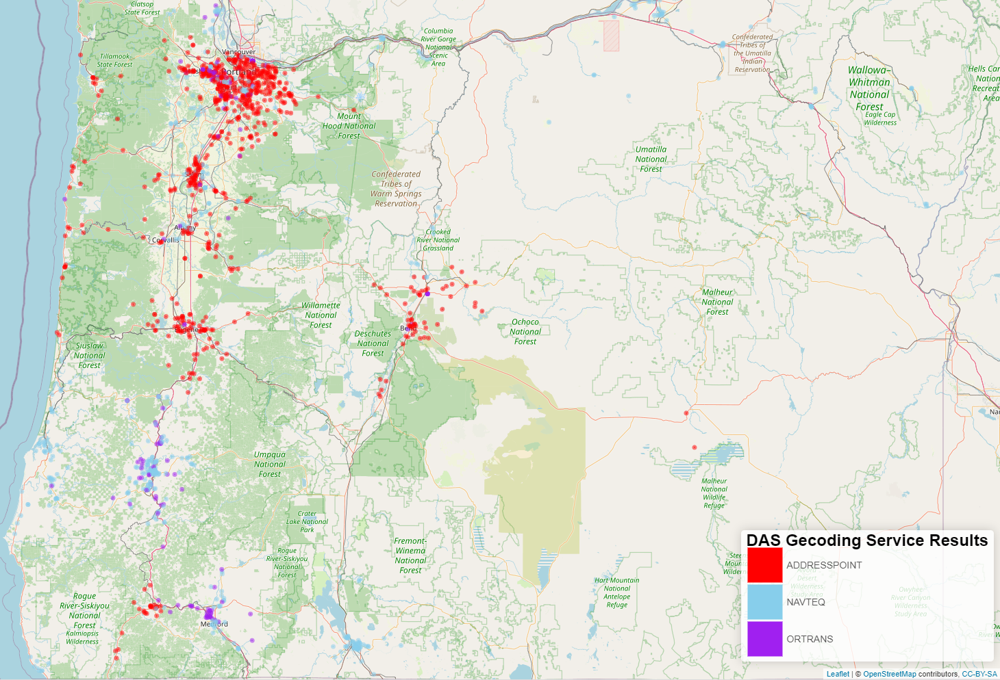

# Project Summary  
This project includes an example of how to use R and an open API geocoding service operated by Oregon Department of Administrative Services (DAS).  More information about the service itself including the meta-data can be found at the following link https://navigator.state.or.us/arcgis/rest/services/Locators/gc_Composite/GeocodeServer

This repository includes a small random set of Oregon addresses to test the scripts and show how this service works using R.

# Script Details  
Two scripts are available in this repository.  The DAS_geocode_service_API.r script will decode addresses iteratively using a slower for loop while DAS_parallel_geocode_service_API.r uses a similar appraoch but 
is set up to do the geocoding using parallelization which, depending on the number of available cores, can significantly decrease processing time.  

### DAS_geocode_service_API.r  
This script uses the sample address file (from the /Data folder) and a batch query function to get the spatial coordinates of the address.  The results
are then post-processed finding the highest scoring results and filtering out results that only returned the centroid of the zipcode in which the address was found.  Results that are only at the zipcode
level may be useful for some purposes but in many cases are too course for analysis and so are discarded.  This could be modified in the script if zipcode level results are sufficient.  The zipcode level 
results are usually returned becuase the address used for geocoding was not specific enough, typcially missing the address and only inlcuding the zipcode and city.  

### DAS_parallel_geocode_service_API.r  
This script performs similar to the above but is structured to do the process using multiple processors.  The code determines the number of processors and uses all but one for parallelization.  

# Post Processing
These scripts write to file batches of geocoded results that require post-processing.  This framework is used to ensure that, espercially when using parallization, results are not lost if the process hangs up.  
It has been a more successful work flow than trying to write out one large file that when the network for the institution I work for hangs up breaks the process.  

# Mapping 
The post processed results are used to create a shape file for use in geographic information systems.  Additionally, a leaflet map (see graphic below) is also created for dynamic exploration of results.

## Leaflet Map Example

### Example of Geocoded Address 
  
